  

  
  
  
  
  

# 🌐 Countries-Per-Capita-Comparison

## 📊 2026 Per-Capita Economic & Infrastructure Comparison

A direct, standalone per-capita comparison analyzing individual consumption, living standards, and infrastructure access across the **United States** 🇺🇸, the **European Union (EU-27)** 🇪🇺, and **China** 🇨🇳 for the year 2026. 

### 📈 Per-Capita Economic, Living Standard, and Infrastructure Metrics (2026)

| 📋 Metric (Per Capita) | 🇺🇸 United States | 🇪🇺 European Union | 🇨🇳 China | 💡 What the Number Represents |
| :--- | :--- | :--- | :--- | :--- |
| 💵 **Nominal GDP** | \$94,430 | \$51,030 | \$14,870 | Raw annual economic output per person in USD. |
| ⚖️ **GDP at Purchasing Power (PPP)** | \$94,430 | \$67,960 | \$31,600 | Economic output per person, adjusted for local cost of living. |
| 💰 **Household Disposable Income** | \$65,400 | \$32,800 | \$6,100 | Annual post-tax money available per person for spending or saving. |
| 🚗 **Passenger Cars** | 0.81 | 0.57 | 0.26 | Number of personal vehicles owned per person. |
| 🏡 **Residential Floor Space** | 810 sq ft | 430 sq ft | 425 sq ft | Average square feet of housing available per person. |
| ⚡ **Annual Electricity Consumption** | 12,850 kWh | 6,050 kWh | 7,450 kWh | Kilowatt-hours used per person (highly driven by industrial grid load in China). |
| 🚄 **High-Speed Rail Access** | 0.23 feet | 91.8 feet | 108.2 feet | Linear feet of operational high-speed track active per 1,000 residents. |
| 🏭 **Annual CO₂ Emissions** | 13.8 tons | 5.9 tons | 8.8 tons | Metric tons of carbon dioxide produced per person. |
| 🏥 **Annual Healthcare Spending** | \$13,400 | \$4,650 | \$720 | Total public and private money spent on health services per person. |
| 🔬 **Annual R&D Spending** | \$2,650 | \$1,280 | \$440 | Gross domestic expenditure on research and experimental development per person. |
| ☀️ **Solar & Wind Capacity** | 1.15 kW | 1.28 kW | 1.35 kW | Cumulative installed renewable wind and solar power generation per person. |
| 📶 **5G Base Stations** | 9.8 | 11.2 | 31.5 | Number of operational 5G cellular base stations deployed per 10,000 people. |
| 🛫 **Annual Air Travel Trips** | 2.8 trips | 1.9 trips | 0.58 trips | Domestic and international commercial airline passenger journeys taken per person. |
| 🥩 **Annual Meat Consumption** | 275 lbs (125 kg) | 168 lbs (76 kg) | 154 lbs (70 kg) | Total meat consumption per person, reflecting protein dietary consumption standards. |

### 🔍 Key Structural Takeaways

* 🏙️ **Physical Space vs. Public Transit:** The average American commands roughly double the physical living space of a European or Chinese citizen, but has practically zero access to high-speed rail infrastructure per person. 
* 🛒 **The Consumer Spending Power Gap:** While China's adjusted GDP (PPP) per capita has reached roughly a third of the US level, its *household disposable income* per capita remains lower. This indicates that a much larger share of China's economic output is driven by corporate and state industrial investment rather than direct consumer power.
* ⚡ **Green Energy & Digital Infrastructure Surge:** China's rapid national buildouts have propelled it ahead in both installed renewable solar/wind capacity per capita (1.35 kW) and telecom density with over 3x the 5G base stations per 10,000 residents compared to the US or EU.
* 💡 **Innovation & High-Mobility Premium:** The United States continues to invest over double the R&D funding per person (\$2,650) relative to Europe and over 6x that of China, alongside world-leading per-capita consumer mobility via commercial air travel.

##  Star History

